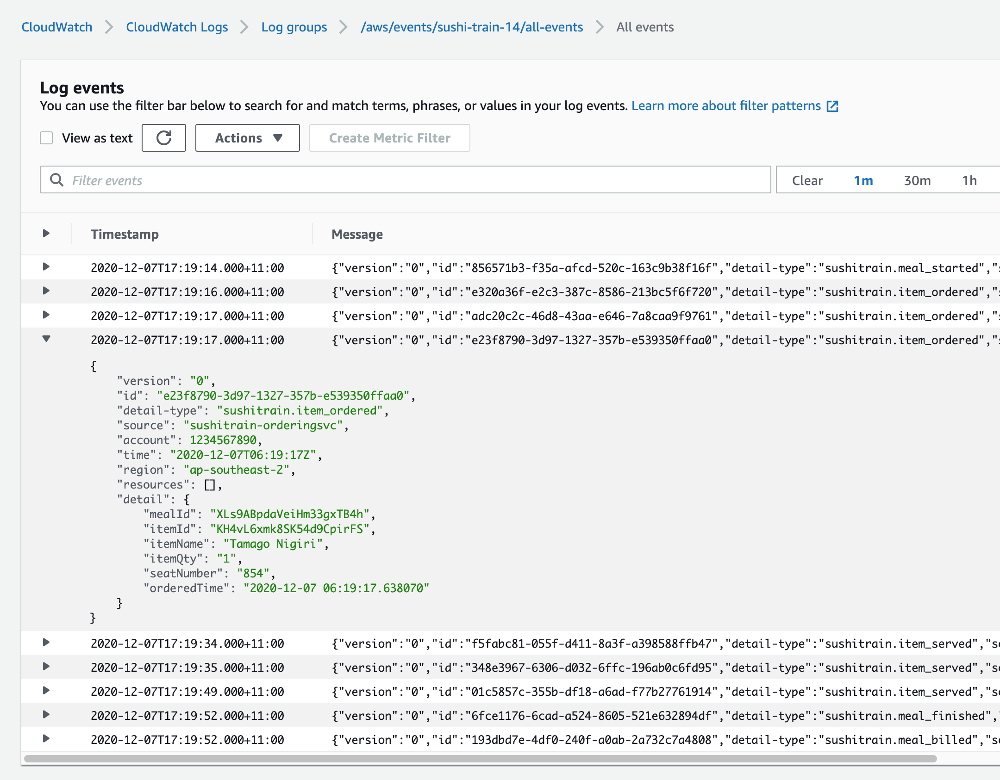

# 🚂 🍣 Serverless Sushi Train

Serverless Sushi Train is a sample application (based on a fictitious restaurant of the same name) built using AWS Serverless technologies like SAM, EventBridge, API Gateway, Lambda, DynamoDB, SQS and Step Functions. The app comprises several loosely-coupled microservices which use a common event bus to choreograph their interactions.

## Scenario  

Customers are able to use a tablet device to manage their meal and orders dishes. When an order is placed, kitchen staff are notified and start preparing the dish. Once the dish is ready to be served, it's swiftly delivered to the customer via a robotic sushi train. When the customer chooses to 'end' their meal the tablet UI displays the total cost of their meal and prints out a slip they can present to the cashier. Restaurant policy dictates that any dish which takes longer than 30 seconds to serve is free.


## Architecture


The solution is composed of:

- **Common Event Bus**: A serverless event bus that routes data between services using pattern-based rules.

- **Orders service**: A RESTful API allowing customers to start a meal, order an item, and end a meal. Requests are handled by Lambda functions and data is persisted to a DynamoDB table. A lambda function responds to data changes and publishes corresponding events to the event bus (meal_started, item_ordered, meal_finished). The service subscribes to item_served events which are pushed onto a queue and processed by a lambda function which updates the order records accordingly. 

- **Kitchen Service**: Receives item_ordered events in a queue and processes these by executing a step function workflow. The step function simulates the process of 'preparing' the dish by calculating a random preparation time (10 - 40 seconds), waiting for the dish to be ready, and then 'serving' the item on the sushi train - which raises an item_served event.

- **Billing Service**: Receives meal_finished events (which include details of items ordered and served) on a queue. A lambda function calculates the pricing of each dish, applies discounts, totals the bill and records the result in table. A trigger function publishes a meal_billed event which includes the above billing information.

- **Notifications Service**: The client connects to a WebSocket API when the meal is started. The mapping between a meal and webSocket connection is record in a DynamoDB table. Events that the customer needs to be notified of (item_served, meal_billed) invoke a lambda function that looks up the webSocket connection details and publishes a message back to the client.

- **Archiving/Monitoring**: A 'catch all' rules pushes all events to Kinesis Data Firehose which batches and writes these raw JSON object to an S3 bucket for long-term archival and analytics. A similar rules pushes all events to a Log Group in CloudWatch Logs (7 day retention) for diagnostic purposes. 

- **Static Website assets**: HTML, JS, CSS resources. 

> **N.b. For the purposes of this sample application, both API gateway endpoints allow open (unauthenticated) access.**

## Deployment Steps 

### 1. Deploy SAM template

(Ensure you have the [AWS SAM CLI](https://docs.aws.amazon.com/serverless-application-model/latest/developerguide/serverless-sam-cli-install.html) installed before proceeding)

```bash
sam build
sam deploy --guided
```

### 2. Make note of the CloudFormation Stack output values

- ```StaticWebBucket```
- ```WebSocketURL```
- ```WebsiteURL```
- ```EventLogGroup```
- ```RestApiURL```
### 3. Set API endpoints

```bash
cd client
```
Open ```index.js``` and set the constants at the top of the file to match the the stack output values ```RestApiURL``` and ```WebSocketURL``` :  

```
const restApiUrl = '';   // Set to RestApiURL
const webSocketUrl = '';    // Set to WebSocketURL
```

Save ```index.js``` 
### 5. Upload Static Content

While still in the ```client``` folder run the following command, replacing {StaticWebBucket} with the ```StaticWebBucket``` stack output value.

```bash
aws s3 cp . s3://{StaticWebBucket} --acl public-read --recursive
```
### 4. Open the website
Open the URL in the ```WebsiteURL``` stack output value. You can use the UI to start a meal, order several items, wait for the items to arrive, and finish the meal. Refresh the page to start a new meal. 

## Understand

To see the events being published to the event bus, open CloudWatch Logs in the AWS console and open the Log Group indicated by the ```EventLogGroup``` stack output. 



When using the website you can can view API and WebSocket activity in the browser console.
## Cleanup

To delete the sample application use the AWS CLI. Assuming you used your project name for the stack name, you can run the following:

```bash
aws cloudformation delete-stack --stack-name sushi-train
```
